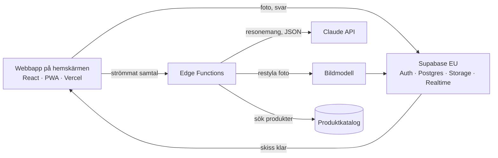

# Designfriend – tjänstedesign

Version 0.1 · 2026-09-27

En kunnig vän som tittar in i ditt rum. Du visar rummet och det du gillar, pratar om hur det ska kännas, och får råd, idéskisser och till slut en plan du faktiskt kan genomföra.

- **Målgrupp:** privatpersoner i Sverige
- **Plattform:** webbapp på hemskärmen (PWA)
- **Omfång:** ett rum i taget
- **Arbetsnamn:** Designfriend

---

## 1. Position

**Det viktigaste:** tjänsten ska uppfattas som en kunnig vän. Bilder och produktlistor kan andra göra. Det som gör tjänsten värd att öppna igen är samtalet: någon som kan inredning, kommer ihåg dig, säger vad den tycker och inte försöker sälja något.

Marknaden för AI-omgjorda rumsbilder är full (RoomGPT, DecorAI, Remodel AI, HomeDesigns AI med flera). Nästan alla är engelskspråkiga och bygger på amerikanska butiker. Luckan är att gå från bild till beslut i svensk kontext:

- **Budget i kronor** och butiker man handlar i: IKEA, Lanna Möbler, Jysk, Mio, Rusta, Ellos och begagnat via Blocket.
- **Hyresrätt eller bostadsrätt** styr vad som får föreslås.
- **Behåll och byt:** soffan stannar, mattan byts, och det behållna styr valet av det nya.
- **Ordning och effekt:** gör detta först, med vad varje steg kostar och ger.
- **Ärliga råd:** minsta ingrepp först, och rakt besked när det räcker att färga soffan.
- **Hjälp att hitta sin smak:** fria idéskisser och ett minne som lär sig.

IKEA Kreativ är det närmaste svenska alternativet: gratis, skannar rummet och placerar IKEA-möbler i rätt skala, men bara IKEA:s produkter. Designfriend konkurrerar inte med skanning och 3D.

## 2. Vad marknaden lär oss om användarna

| Lärdom | För oss |
|---|---|
| Vackra bilder räcker inte. AI-appar ignorerar om förslaget är realistiskt, ryms i budget eller går att köpa. Stilnamn tolkas slarvigt. | Utgå från användarens egna bilder, och låt planen vara det vi levererar. |
| Att hitta produkter i en påhittad bild misslyckas (Wayfairs Decorify). | Välj produkter först och gör bilden efteråt. Hitta närmaste ger en kortlista, inte ett facit. |
| IKEA:s inredningshjälp ber om foton, mått och inspirationsbilder och levererar moodboard, produktlista och planskiss. | Flödet matchar ett beteende folk känner igen. |
| Att tömma rummet på bild är värdefullt. | Töm rummet finns i Utforska. |
| AI-fotoappar behåller användare sämst av alla kategorier. Inredning sker i omgångar. | Minnet och planen i steg gör nästa besök mer värt än det första. |
| Dyra köp avgörs i butiken. | Planen ska gå att ta med till butiken. |
| Svenska användare är dåligt betjänade. | Svenska, svenska butiker och svenska förhållanden. |

## 3. Avgränsning

**Med i MVP**

- Ett rum per projekt, 1–3 foton plus mått skrivna för hand
- Behåll, byt eller ta bort per föremål i fotot, samt Bara det jag valt
- Mina möbler: det som behålls sparas och följer med
- Egen moodboard med 3–12 bilder. Utan moodboard: tre olika idéskisser att reagera på
- Chatt som nav: känslor och material i fri text, kompletteringar och rådfrågor
- Två lägen: Utforska (idéskisser) och Förverkliga (köpbar plan)
- En rekommenderad idéskiss med motivering, fler spår på begäran
- Det här har jag tänkt på med varje förslag, och en logg över beslut
- Gilla och ogilla delar av en idéskiss, Töm rummet
- Åtgärder i planen, inte bara produkter: färga, klä om, överdrag, måla
- Bygg själv: mått, ritning, materiallista och steg
- Spår och versioner: jämför, gå tillbaka, börja inte om
- Palett med NCS- och hex-koder, pipett ur moodboarden, egna koder som facit
- Markera ett område i en idéskiss och beskriva vad som ska dit
- Projektminne, smakminne, Var vi är, Min smak
- Idélogg för användarens förbättringsförslag
- Inloggning, sparade projekt, kontoborttagning

**Senare, eller aldrig**

- LiDAR-skanning med RoomPlan (kräver ett appskal)
- AR-placering (delvis möjlig på webben, kräver 3D-modeller)
- Hela bostaden, planlösningar
- Live-priser och lagerstatus
- Betalning och affärsmodell
- Mänsklig inredare i loopen
- Dela idéskiss med partner (första funktionen efter MVP)
- Rekommendationer baserade på andra användares smak
- Röstsamtal på svenska (egen etapp)

## 4. Användarflöde

Bara fotot krävs. Chatten finns i varje steg, och allt som går att trycka går också att säga i ord.

1. **Fota rummet.** Foto med hjälpraster. Mått är frivilliga men ger bättre möbelförslag.
2. **Vad ska ändras?** Appen hittar föremål i fotot. Varje föremål får Behåll, Byt eller Ta bort. Reglaget Allt annat fritt eller Bara det jag valt.
3. **Moodboard.** Egna bilder. Claude läser av palett, material och former och visar tolkningen för godkännande.
4. **Det här vet jag.** Ingen startskärm att fylla i. Ramar samlas i förbigående och visas här med källa så att de kan rättas. Budget frågas först när användaren vill förverkliga.
5. **Utforska.** En rekommenderad idéskiss med motivering och före/efter-reglage. Gilla, ogilla, justera.
6. **Förverkliga.** Skissen blir en plan med verkliga produkter och åtgärder, störst effekt per krona först.

## 5. Samtalet

### En kunnig vän gör

- Säger vad den tycker, med skäl, och står för det.
- Säger ärligt när något räcker och när något inte blir bra.
- Behandlar användaren som kompetent och delar sin kunskap.
- Utgår från att användaren kan måla, bygga och montera.
- Kommer ihåg vad användaren sagt och inte gillade.
- Respekterar användarens smak.
- Säger "det vet jag inte" och när en fackman behövs.

### En kunnig vän gör inte

- Säljer, eller föreslår köp när en åtgärd räcker.
- Berömmer varje val eller svarar med superlativ.
- Förklarar självklarheter eller låter som en lärare.
- Ställer frågor i serie som ett formulär.
- Gissar vem användaren är utifrån kön eller ålder. Kön frågas inte efter och lagras inte.

### På användarens nivå

- **Språk:** med en formgivare pratar vännen som en kollega (kulör, kontrast, proportion, visuell vikt). Med den som inte är van, samma resonemang i vardagliga ord.
- **Ärliga koder:** varje palett med NCS- och hex-kod. Användarens egna koder är facit. Koder uppskattade ur foton märks alltid som uppskattningar. Provmålning föreslås före beslut.
- **Roller:** tydlig om det praktiska, sparringpartner om det estetiska. Användarens öga avgör.
- **Eget:** pipett, justerbar palett, egna skisser, markera område i skiss. Egna byggen och egen grafik kan bli en del av rummet.

### Trygghet i besluten

- **Rekommendera:** ett förslag med skäl. Andra spår på begäran.
- **Det här har jag tänkt på:** mått och gångytor, ljus dag och kväll, förvaring, husdjur, städning, leverans, dörrar, returrätt, det gamla. Det som inte är kollat står som öppet.
- **Går att ändra:** vad som är billigt att ångra och vad som inte är det.
- **Beslut med skäl:** beslut loggas med skäl och kan öppnas igen, men då visas varför de fattades.

**Fram och tillbaka hör till.** Alla versioner sparas som spår. När samma beslut öppnas för tredje gången sammanfattar vännen det som varit stabilt. Den föreslår att pröva billigt på riktigt.

### När svaret saknas

| Läge | Exempel | Vännen gör | Visas som |
|---|---|---|---|
| Går att ta reda på | Priset på en verklig soffa | Slår upp och anger källa och datum | Källa, datum |
| Går att uppskatta | Priset på soffan i en idéskiss | Intervall, vad det bygger på, erbjuder Hitta närmaste | Uppskattning |
| Går inte att veta härifrån | Vad en tapetserare tar | Vad det beror på, vem som kan svara, utkast till förfrågan | Öppen fråga |
| Utanför området | El, bärande vägg, föreningens regler | Vilken fackman som behövs | Öppen fråga |

Öppna frågor hamnar i Det här har jag tänkt på med nästa steg.

### Lära känna, inte intervjua

- Visa först, fråga sen.
- Resonera högt så att användaren kan säga emot.
- Gissa och låt rätta, sparsamt.
- Plocka upp det som sägs i förbigående.
- Fråga om livet, inte om stilen.
- Högst en fråga per svar, och bara om svaret ändrar förslaget.
- Samma sak frågas aldrig två gånger.
- Praktiska ramar frågas när de behövs.

### Tre slags frågor

- **Komplettera:** "Vad saknas för att det ska kännas ombonat?"
- **Behåll och byt:** "Behåll mattan, byt soffan."
- **Rådfråga:** "Räcker det att färga tyget?"

### Känslor blir designval

| Ord | Blir |
|---|---|
| lugnt | lägre kontrast, färre föremål, dämpad palett |
| ombonat | varmt ljus runt 2700 K, textilier i lager, fler lampor lågt |
| luftigt | ljusa väggar, möbler på ben, fri golvyta |
| som i skärgården | blekt trä, linne, blågrått, naturmaterial |

### Minsta ingrepp först

1. **Komplettera:** textilier, ljus, växter, konst
2. **Fräscha upp:** rengör, nya fodral, måla en vägg
3. **Förnya:** färga tyg, överdrag, klä om, nya ben, måla möbeln, bygg om
4. **Byt:** bygg själv, begagnat eller nytt

**Bygg själv:** mått anpassade till rummet, ritning, materiallista, verktyg och steg. Idéskissen visar resultatet innan första brädan är köpt.

**Beslut tillsammans:** vännen söker kompromisser mellan två smaker och formulerar varför ett förslag fungerar, så att det går att visa för den andra.

## 6. Moodboard

1. **Ladda upp** 3–12 bilder, stjärnmärk en favorit, skriv en rad per bild.
2. **Tolka:** Claude ger en strukturerad stilprofil.
3. **Bekräfta:** tolkningen visas som chips som kan rättas.
4. **Använd:** profilen styr produktval, favoriterna skickas som referens till bildmodellen.

Exempel på stilprofil (färger är uppskattade ur foton):

```json
{
  "sammanfattning": "Varm, lugn och levd. Naturmaterial, jordtoner och mjukt ljus, med ett fåtal skulpturala föremål",
  "palett": [
    {"hex": "#EDE6DA", "roll": "bas, kalkvitt"},
    {"hex": "#C9BFA8", "roll": "linne, havre"},
    {"hex": "#9A5B34", "roll": "cognac, rost"},
    {"hex": "#6B6A63", "roll": "grafit, putsad vägg"},
    {"hex": "#2A3F9A", "roll": "en enda koboltblå detalj"}
  ],
  "material": ["tvättat linne", "cognacsfärgat läder", "oljat trä", "ull och lugg", "rispapper", "kalkputs", "jute", "terrakotta"],
  "former": ["organiska och rundade", "låga möbler", "skulpturala småföremål"],
  "ljus": "dämpat och varmt, pappersskärmar, levande ljus",
  "föremål": [
    {"bild": [7, 8], "vad": "lädersoffa i cognac", "vikt": "hög, återkommer två gånger"},
    {"bild": [1, 9], "vad": "pendel i papper", "vikt": "hög, återkommer två gånger"}
  ],
  "känsla": ["lugnt", "ombonat", "personligt", "inte perfekt stylat"],
  "undvik": ["högblanka ytor", "kallt vitt ljus", "starka mönster"],
  "osäkert": "två bilder har mörka väggar, övriga ljusa"
}
```

**Risker:** bildmodellen kopierar moodboarden (rumsfotot ska alltid vara bilden som redigeras; skicka 2–4 favoriter), moodboarden spretar (fråga, eller gör olika spår), hitta liknande produkter (text först, bildvektorer senare). Andras bilder från Pinterest och Instagram används bara som privat referens.

## 7. Två lägen

- **Utforska · Idéskiss:** tjänsten ritar fritt. Användaren gillar och ogillar delar. Töm rummet visar rummet utan möbler som inte är markerade Behåll. Behöver ingen katalog.
- **Förverkliga · Köpbar plan:** skissen blir verkliga produkter inom budget. Listan kan tas med till butiken.
- **Hitta närmaste:** peka på ett föremål i en skiss och få en kortlista med de tre mest lika produkterna, märkta "liknande, inte samma".

## 8. Behåll och byt

- **Behåll:** exakt likadant, styr valet av det nya.
- **Byt:** ge mig förslag.
- **Ta bort:** ska bort.

Reglaget **Allt annat fritt** / **Bara det jag valt**.

Teknik i fyra steg:

1. **Hitta:** Claude listar föremål, SAM ger exakt kontur vid tryck.
2. **Maska:** bildmodellen får bara rita i masken. För en matta täcker masken golvytan, inte bara den gamla konturen.
3. **Återställ:** originalets pixlar kopieras tillbaka utanför masken, med mjuk övergång. Det behållna är garanterat oförändrat.
4. **Matcha:** det behållna styr färg, material och storlek. Budget gäller bara det som byts.

**Mina möbler:** det som behålls sparas med foto, namn, mått och rum, och följer med till nästa projekt.

## 9. Minnet

| Minne | Innehåll | Räckvidd | Används |
|---|---|---|---|
| Samtalsloggen | Varje meddelande, bild och skiss | Projekt | Sökbar när något behöver slås upp |
| Projektminnet | Mål, prövat och förkastat, beslut, öppna frågor, pågående | Projekt | Laddas in när samtalet återupptas |
| Smakminnet | Preferenser och Mina möbler | Användare | Följer med till nästa rum |
| Arbetssättet | Hur användaren resonerar och vad som hjälper | Användare | Styr hur förslag läggs fram |

Exempel på projektminne:

```json
{
  "mål": "Vardagsrummet ska kännas lugnare och varmare",
  "prövat": [
    {"vad": "mörk tv-vägg, S 6005-Y20R", "utfall": "förkastad", "varför": "för tungt mot bokhyllan", "citat": "det blir en grotta"}
  ],
  "beslut": [{"vad": "behåll mattan och linnesoffan", "varför": "bär hela rummet", "lätt_att_ändra": false}],
  "öppna_frågor": [{"fråga": "tar soffklädseln färg?", "nästa_steg": "kolla tvättlappen"}],
  "pågående": "Fåtöljen är det som skaver",
  "stabilt_över_versioner": ["mattan", "varmt trä", "mjukt ljus"]
}
```

**Återkomst:** tråden tas upp i en mening, inga upprepade frågor, förkastade idéer föreslås inte igen, gamla priser kontrolleras, ingen tjat om öppna frågor.

**Var vi är:** en skärm som visar projektminnet i läsbar form och kan rättas.

**Smakminnet** bygger på en logg av signaler (uttalat, reaktioner, dialog) som sammanfattas till en profil. En gång är ett tecken, tre gånger ett mönster. Varje preferens har räckvidd: användare, projekt eller rum. Äldre signaler väger mindre. Motsägelser löses genom att fråga. Skärmen Min smak visar allt med källa.

**Arbetssättet:** signaler loggas från första samtalet. En lärdom aktiveras när den har minst tre belägg från minst två olika pass och säkerhet minst 0,7 (utgångsvärden som justeras). Den bekräftas i samtalet som en fråga. Lärdomar beskriver vad som hjälper, aldrig vem personen är. Inget förs in i förväg av någon annan. Allt syns och kan stängas av. Målet är trygghet, inte snabbare beslut.

## 10. Röst

Rösten gör vännen användbar när händerna är upptagna. Krav: Claude resonerar även i röstläget, och pausen får inte bli onaturlig.

- **Öron:** strömmad svensk taligenkänning med ordlista för NCS-koder och material
- **Hjärna:** Claude med cachat sammanhang
- **Röst:** strömmad svensk talsyntes som börjar på första meningen
- **Skärm:** skisser, koder och listor visas, läses inte upp

Uppskattad tid från tystnad till första ljud: cirka 1–2 s. Ska mätas. Realtidsröster från andra leverantörer väljs bort, eftersom vännen då inte är Claude. Om Anthropic erbjuder ett eget röst-API är det förstahandsvalet.

Ordning: diktering via tangentbordet fungerar från etapp 1, uppläsning efter etapp 1, fullt röstsamtal i en egen etapp när texten känns rätt.

## 11. Användarens idéer

| Nivå | Exempel | Vem gör vad |
|---|---|---|
| 1 · Gäller bara användaren | "Visa alltid NCS-koden först" | Vännen ändrar direkt och bekräftar |
| 2 · Ändrar tjänsten för alla | "Fråga alltid om hissen" | Vännen formulerar ändringsförslag, testsviten körs, utvecklaren godkänner |
| 3 · Ny funktion | Dela skiss, AR | Sparas i idéloggen, tittas på tillsammans |

Kärnprinciperna (ärlighet, integritet, en fråga i taget, inga påhittade fakta) går inte att ändra genom återkoppling.

## 12. Arkitektur



| Del | Val |
|---|---|
| Webbapp | React och TypeScript som PWA på Vercel |
| Backend | Supabase i EU: databas, inloggning, lagring, serverfunktioner, Realtime |
| Rådgivaren | Claude med verktyg: tolka foto, markera föremål, göra idéskiss, söka produkt, webbsöka pris, föreslå åtgärd, skapa öppen fråga, uppdatera minne, ställa följdfråga. Varje sakuppgift märks: källa, uppskattning eller okänd |
| Bild | Testa gpt-image-2, Nano Banana 2, FLUX.2 pro edit i etapp 0. Färgtrohet prioriteras |
| Föremål | Claude för namn, SAM för konturer |
| Produkter | Egen JSON-katalog, sedan affiliate-produktflöden |

**Datamodell:** `projekt` → `rum` → `föremål` → `moodboard_bild` → `stilprofil` → `förslag` → `planrad` (produkt, åtgärd, bygge eller tjänst). `meddelande` med pgvector, `projektminne`, `beslut`, `spår`. På användarnivå: `preferens_signal`, `smakprofil`, `mina_möbler`, `arbetssätt`. Dessutom `idé`, `ändringsförslag` och `produkt`.

## 13. Webbappen

- **Hemskärmen:** iPhone föreslår det inte själv. Första gången visas en kort guide.
- **Inloggning utan länk:** en webbapp på hemskärmen har egen lagring skild från Safari, så en inloggningslänk fungerar dåligt. I etapp 1a e-post och lösenord som utvecklaren sätter. Engångskod via mejl när egen SMTP finns. Ingen kan registrera sig själv.
- **Foton:** kamera eller kamerarulle, nedskalning till cirka 2000 px och borttagen platsdata i telefonen.
- **Strömmat och bakgrund:** text strömmas, skisser görs som bakgrundsjobb och dyker upp när de är klara.
- **Utan uppkoppling:** Var vi är och planen går att läsa.
- **Det webben inte kan:** LiDAR och RoomPlan. AR delvis via AR Quick Look och WebXR. Appskal (Capacitor) om det behövs.

## 14. Kostnad

Typisk session: åtta bilder. Växelkurs cirka 10 kr/USD, listpriser september 2026.

| Bildmodell | Per bild | Per rum, ca |
|---|---|---|
| gpt-image-2 (medium) | $0,014 | 1,50 kr |
| FLUX.2 pro edit | $0,045 | 4 kr |
| Nano Banana 2 (1K) | $0,067 | 6 kr |

Tak per användare och dag, och utgiftstak i API-kontona. Vercel och Supabase har gratisnivåer. Supabases gratisprojekt pausas efter en tids inaktivitet.

## 15. Risker och juridik

- **Möblerna får inte plats:** välj produkter med verkliga mått först, bilden efteråt.
- **Bilden och listan stämmer inte:** skicka produktbilder som referens, visa listan bredvid.
- **Rummet ändrar form:** bevara struktur, låt användaren generera om.
- **Juridik:** lagra i EU, integritetspolicy, foton som skickas till Claude lagras i Anthropics Files API och raderas med kontot, radering enligt GDPR, platsdata bort ur foton, märk genererade bilder som AI-illustrationer.

## 16. Testsvit

Se `evals/kriterier.md`.

## 17. Byggplan

- **Etapp 0 · en helg.** Samtalet: systemprompten testas i ett Claude-projekt tills tonen känns rätt. Bilderna: tio rum, fem moodboards, tre bildmodeller, tre rum med soffan behållen och bara mattan bytt. *Klart när* användaren tycker att vännen låter som en vän, bildmodell är vald och det behållna är oförändrat.
- **Etapp 1 · 2–3 veckor.** Utforska-läget i webbappen: hemskärm, inloggning, foton, steg 1–5, markering med mask och återställning, moodboard, chatten med verktyg, rådfrågor och åtgärder. *Klart när* användaren kan lägga appen på hemskärmen, fota rummet och få en rekommenderad idéskiss i ett samtal som fortsätter där det slutade.
- **Etapp 2 · 2 veckor.** Minnet: projektminne, sökning i loggen, Var vi är, smakminne, Min smak, arbetssättets signaler. *Klart när* ett samtal kan återupptas efter tre dagar utan att något sägs två gånger.
- **Etapp 3 · 2–3 veckor.** Förverkliga-läget: katalog, plan, budget, Hitta närmaste, kostnadstak. *Klart när* en skiss blir en köpbar lista som håller budget.
- **Etapp R · 2–3 veckor.** Röstsamtal. *Klart när* fördröjningen är mätt och samtalet känns naturligt.
- **Etapp 4 · löpande.** Tio användare via inbjudan. Granska lärdomar och idélogg. Fråga först om samtalet.

## 18. Öppna beslut

- **Bildmodell:** avgörs i etapp 0.
- **Mått:** manuellt, gärna med iPhones Mätverktyg.
- **Katalog:** IKEA och Lanna Möbler plus en kedja, begagnat som tips.
- **Namn och domän:** före etapp 4.
